```{r setup, include=FALSE}
knitr::opts_chunk$set(echo = TRUE, fig.align='center')
options(warn=-1)
```

# What you need to know about ArboMAP

ArboMAP is a program used to model and predict cases of vector-borne disease. Here we consider human cases of the mosquito-born West Nile virus, but ArboMAP will likely work with any data set in which:

* there are multiple (>3) years of infection data from years in which the pathogen can be considered endemic, after any introductory years in which the pathogen is probably rapidly exploiting naive populations and should not yet be considered established
* the disease has distinct transmission and quiescent seasons, including an initial, annual exponential growth phase when the pathogen is beginning to spread after a period of relatively few cases
* there is reason to believe that incidence responds to measurable environmental indices, almost certainly including temperature and probably some measure of moisture in the environment (e.g. precipitation or humidity)
* cases of disease are assigned to districts (states, counties, etc.) and cases are not too rare - every modeled district should have at least one case over the period of study, as the model will assume a district is permanently immune if no cases have been observed there
* some measure of pathogen in the environment is available; e.g. here we use the rate at which pools of mosquitoes test positive for the virus.

In what follows we use the language of our West Nile virus studies (mosquitoes, counties, etc.) but the modeling approach does not rely on those details and any appropriate data set can be substituted.

The ArboMAP user guide consists of four main sections. The first section describes how to install the necessary software needed to run the system. The second section describes the steps that need to be taken every year before the beginning of the WNV season to prepare for forecasting. The third section description the steps that need to be taken each time a new forecast is generated. The final section describes the outputs produces by ArboMAP and explains how to interpret the forecast charts and maps.

# What you need to know about WNV and modeling

West Nile virus (WNV) in South Dakota is our example in this document. WNV circulates primarily among mosquitoes and birds, but occasionally spills over into human or other hosts. In humans, the majority (~80%) of infections show no symptoms and are not diagnosed except perhaps accidentally during blood donation. Some small proportion of individuals will develop symptoms such as headache, fever, and rash, but in about 1 out of every 100 infected individuals, the disease becomes neuroinvasive and can cause debilitating illness and death.

WNV was first introduced to the US in 1999 on the east coast, after which it spread in a westward-moving wave across the US. The early years produced thousands of cases as WNV invaded new regions. Birds were immunologically naive, so the virus decimated entire avian populations and spilled over into humans in an outbreak that lasted several years in some states.

In South Dakota, there were more than a thousand diagnosed cases in 2002-2003, which implies that many more were actually infected, since most infected individuals do not show symptoms and are never diagnosed. After a number of years of active transmission, case numbers declined and it looked like the disease might vanish from circulation after 2011, in which there were only two cases reported.

However, in 2012 there was another outbreak, with hundreds of cases in South Dakota. Because of these massive fluctuations in annual case counts, there is a need to predict the magnitude and locations of WNV in advance to support proactive mosquito control and disease prevention activities. Thus, a key scientific question is whether there are there any environmental or entomological indicators that could tell us, in advance, how bad a year is likely to be.

In fact, yes. Work by Dr. Michael Wimberly's research group has shown that a relatively simple statistical model, relying on weather and mosquito infection data, can be used to predict the risk of infection on a county-week basis. For more background, you will want to consult relevant journal articles, which are listed at the end of this document. In particular, the paper by Davis et al. (2018 in Acta Tropica) provides details about the underlying statistical model.

# Setting up for the initial run

## Some accounts you'll need

You will need some measure of pathogen in the environment; obtaining these data is usually a substantial undertaking requiring multiple locations and participants, so this will probably be stored in some central database requiring a login. Here, we use a website to which participants around the state added their mosquito infection data.

You will need some measure of the environment so that relationships between disease and environment can be modeled. Here we use the gridMET dataset, downloaded from Google Earth Engine (GEE). GEE is a cloud-based platform for processing satellite remote sensing images and other geospatial datasets. Instead of downloading the data and processing it yourself, GEE uses cloud-based computers and algorithms to do in half an hour what might take a standard desktop computer a week to calculate.

To access GEE, you will first need a gmail account at **[mail.google.com](https://mail.google.com)**, so that you can access Google Drive documents at **[drive.google.com](https://drive.google.com)**. Next, visit GEE at **[earthengine.google.com](https://earthengine.google.com/)** and click on \"Sign Up\" to request an account. You receive confirmation at your gmail address, and any downloads of weather data will be stored in the Google Drive of the account.

Finally, you will need outcome data, usually human cases. These data are probably best obtained by data-sharing agreements with a health department. Up-to-date case counts are not necessary - ArboMAP models the current year based on all previous years, and does not rely on case counts in the current year, which are in any case usually misleadingly low. The location of residence (or transmission) and the date of onset of symptoms (or diagnosis or detection) are required. The date of onset is rounded to week in this analysis and the location should be a larger district (e.g. county) rather than a specific address.

## Some software you'll need

### \ \ \ \ \ R

R (**[www.r-project.org](https://www.r-project.org/)**) is a statistical programming language that runs all of our analyses and produces reports and documentation, including this document. It is free and has a wide variety of packages built by users all around the world to do essentially any statistical analysis you can imagine.

It is easiest to download R from CRAN (**[cloud.r-project.org](https://cloud.r-project.org/)**). Click on the link for \"Download R for Windows.\" Choose \"base,\" then \"Download R for Windows.\" Run this file and install R on your system. Use the default settings for the installer.

### \ \ \ \ \ RStudio

RStudio (**[www.rstudio.com](https://www.rstudio.com/)**) is a user-friendly GUI for the statistical programming language R that greatly simplifies a number of tasks for the programmer. Navigate to the site, click on Download, and choose the RStudio Desktop (Open Source License) - that is, the free version. Run the appropriate installer, very likely the Windows Vista/7/8/10 installer. 

Run RStudio and close it at least once after you've installed MiKTeX as described in the next section. RStudio may not be able to find MiKTeX unless it's had a chance to search. 

### \ \ \ \ \ MiKTeX

MiKTeX (**[www.miktex.org](https://www.miktex.org/)**) is an implementation of LaTeX, which is what allows us to automatically produce PDF reports at the end of all the calculations. Navigate to the site, click on Download -> Windows and then download and run the installer. Default options will suffice, but make one change: \"Install missing packages on-the-fly\" should be changed to \"yes.\" You will initially install an incomplete copy of MiKTeX, and it will be updated automatically whenever you run the code. This means that the first time you run the code, it might take quite a while.

An alternative is to choose the Net Installer from the \"All Downloads\" page, and to choose \"Complete Installation.\" This will take a great deal of time, and you should only do it on a fast connection, but it means you will only ever have to do this once. Expect that this will take a few hours - if you can afford the time to do this, it's worth getting all the downloads done. You will probably be asked to select a source/server/mirror from which to download your files - you can choose the 0-Cloud, which will automatically find a fast download site for you, or you can manually pick somewhere close to you physically.

## Setting up the directory structure

ArboMAP requires a variety of files to run, and the following directory structure is the easiest way to organize everything that's necessary. Here we have a D: drive with a directory called ArboMAP - this directory contains everything necessary to run the model. Advanced users can change this directory structure by modifying ArboMAP's code.

```{r echo=FALSE, out.width='80%'}
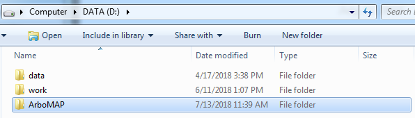
```

This ArboMAP folder should contain one Rmd file and seven subfolders, each containing either data used to run the model or outputs from the model.

```{r echo=FALSE, out.width='80%'}
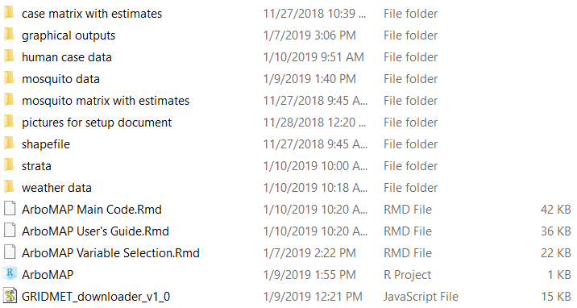
```

The folders are as follows:

* `case matrix with estimates` will hold a single file at the end of processing, which contains all the numerical data used for modeling and the estimates for each county and week. This can be used for additional statistical analyses if desired.
* `graphical outputs` will contain a number of PNG files at the end of processing. These images are the same images in the PDF output, but are provided so that the images can be used in other media if desired.
* `gridMet` contains a number of CSV files holding the weather data. This folder should only contain weather data, as any additional files placed here will cause errors in processing.
* `human` contains the historical human case data file.
* `mosquito` contains the mosquito pool infection data files.
* `shapefile` contains the files used to map risk. This is by default South Dakota, but these files may be replaced with any similar SHP file.
* `strata` contains a file that tells the model how to split the state into different geographic regions.

Finally, the `ArboMAP.Rmd` file contains all the modeling code. This file is opened in RStudio and pulls data from the directories above, produces estimates, and outputs a PDF file and a variety of other files in the output directories.

## Files and settings

The Rmd file, which you will open in RStudio, contains a preface (shown below) with settings that tells the program where to find the various pieces of data used to make predictions. Errors in these filenames are a common reason that the code will refuse to run.

* `graphicoutputdir` tells the program where to store its graphical outputs. You may want to use some of the graphics in the PDF for your own purposes, so they will be stored in PNG format in this directory.
* `humandatafile` contains the human WNV cases
* `maxobservedhumandate` tells the program which is the last human case that should be used in modeling. If you happen to know that there are some cases in 2018 and you're predicting 2018, then you should set this to the end of 2017. We do not use the current year's data in making predictions, and trying to do so will mess up the predictions. This is an extra safeguard in case you do accidentally update the case file to include data from this year.
* `weekinquestion` tells the program which week you'd like to obtain predictions for. Weeks in this program begin on Sunday and run until the next Saturday, and the weekinquestion date will automatically be rounded to the previous Sunday. For example, if 2018-07-16 happens to be a Monday, then the week examined is 2018-07-15 (Sunday) through 2018-07-21 (Saturday).
* `gridmetpathstr` indicates the directory where all the gridmet CSV files are stored
* `gridmetsummaryfile` is the name of the file that the program will create to summarize all the CSV files. Since it's possible you've downloaded a year many times (especially the current year), the program has to create a summary file and stores it with the rest of the gridMet data. Other than this extra file and all the CSV files, there should be nothing else in this directory.
* `acttestfile` and `arctestfile` tell us where to find the active and archive mosquito testing data
* `stratafile` tells us where to find the file containing the data to split up the state into four regions to model the mosquito infection rate (see below)
* `countyshapefile` points to the SHP file for mapping SD counties
* `compyear1` and `compyear2` indicate which two years in the past we'd like to compare the current year to in one of the graphics.

`Maxobservedhumandate` should be updated at the beginning of every season to point to the end of last year, so that only human cases in previous years are used to condition the model's predictions. `Weekinquestion` should be updated weekly.


```{r echo=FALSE, out.width='80%'}
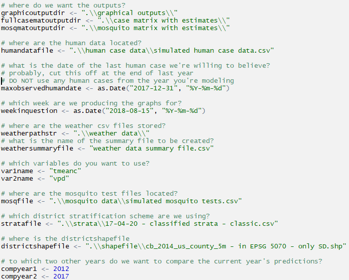
```

## Obtaining data at the beginning of the season

### \ \ \ \ \ Obtaining the gridMET data

ArboMAP requires weather data to make its predictions. You will use likely Google Earth Engine (GEE) to download historical weather data beginning a full year before your human case data (e.g. if you begin modeling in 2001, you will need to download all data beginning in 2000). If you want to download all data, it will not hurt the calculations; simply begin in 1950). You will only need to download historical data once; every other time you run the program, you will only need to download the most recent year's weather data from GEE.

You will be given a link to code you can use to download the weather data. Once you click on this link and sign in to the Google account you used to sign up for Google Earth Engine, you should see a page like the following:

```{r echo=FALSE, out.width='80%'}
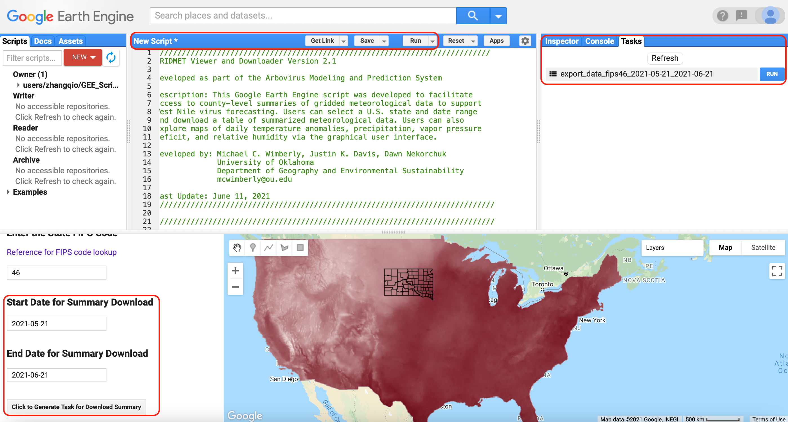
```

Click on the textured bar above \"Show Code\" and drag down to view the code. You don't need to modify any of the code, but this will allow you to see the Tasks tab, which will allow you to download the data. Set the \"Start Date for Summary\" to YYYY-01-01, where YYYY is the year of data you wish to begin in, and set the \"End Date for Summary\" to some point in the future. You can set the End Date to 2050-01-01, and you will be given the most up-to-date weather data. 

```{r echo=FALSE, out.width='40%'}
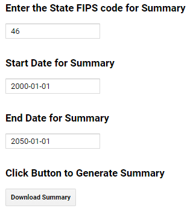
```

You can change some of the other options, if you'd like to modify your download. If you're not using the data for South Dakota, for example, which has FIPS code 46, you can choose another state from the list of codes (**[click here for codes](https://en.wikipedia.org/wiki/Federal_Information_Processing_Standard_state_code)**).

Click on \"Download Summary.\" This will create a task called myExportTable Task under the Tasks tab. Click on Run. If you do see this or any of the code, click on the textured bar directly above the map and drag down. This should reveal the code windows.

```{r echo=FALSE, out.width='100%'}
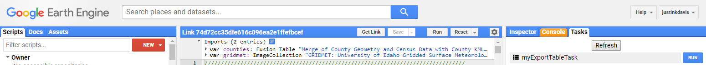
```

Name the task \"historicaldownload\" and name the file \"historicaldownload\" - note that there are no spaces. Click on "Run" in this window in the Tasks tab. If the Tasks tab is not visible, remember to pull down the bar directly above the map.

```{r echo=FALSE, out.width='40%'}
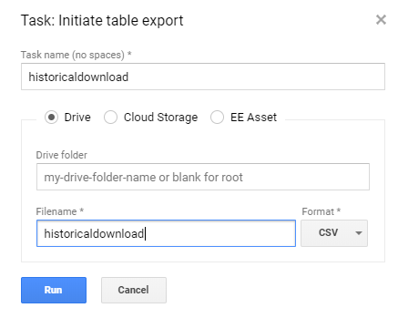
```

Processing can take half an hour for this initial data pull, depending on who else is using the system, and very rarely your job can be cancelled - you might receive an error about \"too many objects,\" in which case you should try again later or split the download into individual years. Once it's done, there will be an extra file in your Google account's drive at **[drive.google.com](https://drive.google.com)** called \"historicaldownload.csv\".

```{r echo=FALSE, out.width='100%'}
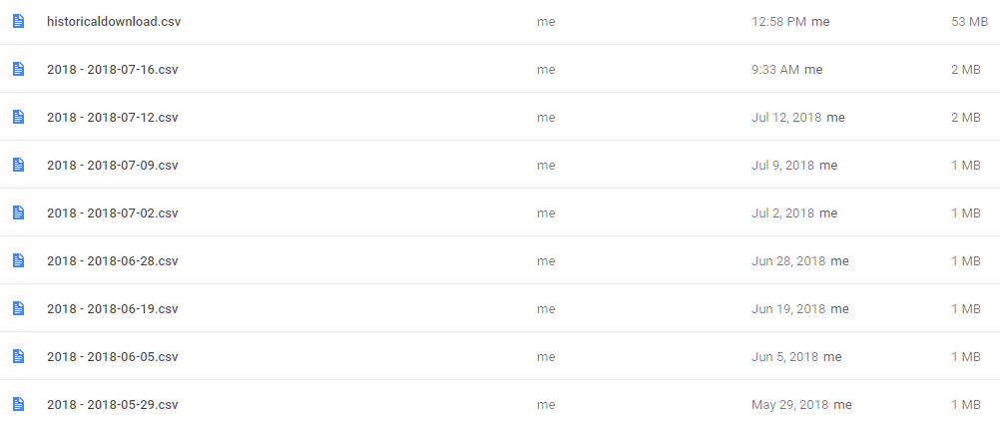
```

Download this file (right-click -> download) and save it in a directory with all the other gridMet data; by default this is \"D:/ArboMAP/gridMet/\". You will eventually add updates for weather data in the current year (2018 at the time of writing), as discussed below, and these are the files beginning with \"2018 - \". These updates are stored as extra CSV files and, along with the historical download, give you a complete picture of the daily weather in every county.

```{r echo=FALSE, out.width='60%'}
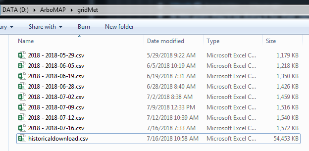
```

Note that it doesn't matter how many times you download a date's weather data, as long as it appears at least once in the data. Every single one of these 2018 files contains weather data for 2018-01-01, for example. Additional measurements will not affect the predictions, and any data that are represented more than once are simplified before inclusion into the model.

#### If you're not using GEE

Although GEE is recommended for a variety of reasons, you might obtain your environmental data from elsewhere. Below is format expected of any CSV file that you might instead supply. Fips is a numerical code tying areal units (e.g. counties) to the measurements of the environment; here, this is the Federal Information Processing Standard that the US uses to identify counties. You can use whichever unique identifier ties environment to county. The "doy" indicates the day of the year (1-366). The remaining columns are measurements of environmental conditions. If your measurements are not daily (e.g. 7-day precipitation totals), they will need to be resampled to that temporal resolution.

```{r echo=FALSE, out.width='60%'}
knitr::include_graphics('pictures for setup document/whats inside gridmet data.PNG')
```

### \ \ \ \ \ Obtaining the human case data

You will only need to update the human case data file once at the beginning of each season. For example, to make WNV forecasts for 2018, the model is calibrated using human case data through the end of 2017, and 2018 case data are not incorporated until data are finalized after the end of the 2018 WNV season. Only two pieces of information are needed for every human case: a date and a county. The date is the symptom onset date (in the case of clinical cases) or the date of blood donation (in the case of viremic blood donors). The county is the patient's county of residence. Each row represents a single case.

The CSV file you use should that contains the human case data should have a unique column named \"creationdate\" that is formatted MM/DD/YYYY, and a column named \"county\" that contains standard names for location of residence (or transmission, if available). The names of areal units are simplified by the code, so that any of the following are equivalent: BROOKINGS, Brookings, brookings, Brookings County, BROOKINGS COUNTY. These will all be reduced to \"brookings\" in the output.

It does not matter which other columns are present, as long as each row contains at least these two values. We have randomly generated some human case data that resemble the trends observed in WNV in SD. The following picture shows the expected format.

```{r echo=FALSE, out.width='80%'}
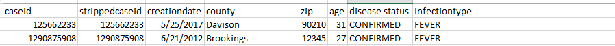
```

Save this file in its own directory. By default this is \"D:/ArboMAP/human/simulated human case data.csv\".

**Do not include any human case data from the year you are modeling.** If you're making predictions for 2018, your model should be based on all human case data up to December 2017. If you include any human case data for 2018 - for example, if you know that there were a handful of cases already in mid-July 2018 and update the human case data file during the season - then the model will assume that human case data for 2018 are complete. This is almost certainly incorrect, since some cases are only reported weeks or months after diagnosis, and human case counts during the season will therefore underestimate the actual disease burden.

### \ \ \ \ \ Formatting the vector infection data

Here we use a list of tested mosquito pools to quantify the amount of pathogen present in the environment. All tests should be present in a single CSV file, with the following columns in the following formats. The pool_size and species columns can be replaced by 1 and "default" respectively, but should be present. The wnv_result column can be 0 for a negative test or 1 for a positive test. Save this file in its own directory. By default this is \"D:/ArboMAP/mosquito data/simulated mosquito tests.csv\".

```{r echo=FALSE, out.width='80%'}
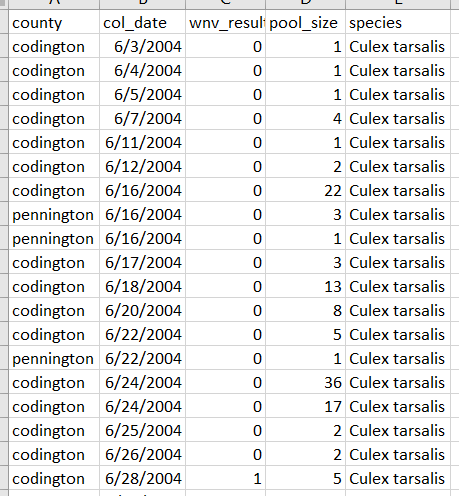
```

### \ \ \ \ \ A note on standardized place names

ArboMAP was designed to model WNV on a county-week basis, but can work with any geographical unit as long as each area is assigned a unique, stable identifier. Ideally, you would like to work with something like the FIPS code, but here we've chosen to work with county names as that is how the data are usually delivered. This presents some difficulties, since these names are probably not completely standardized in your sources; e.g. some sources will list \"Brookings County\" while others will simply use \"Brookings\".

ArboMAP reduces all names by deleting \"County\" and \"Parish\", removing all spaces from the county name, and putting the county name in lowercase. Therefore, \"BROOKINGS COUNTY\" becomes \"brookings\" and \"Charles Mix County\" becomes \"charlesmix\". This gives the greatest chance that all places will be recognized in all data sources. However, incorrect spellings and invalid date formats (e.g. DD/MM/YYYY instead of MM/DD/YYYY) cannot be fixed by the program and will result in errors.

# The typical run during the season

## Updating the data during the season

Before you run the model during the WNV season, you will want to be sure you have the most up-to-date weather and mosquito data. These updates are simpler than the updates that need to be run once per year at the beginning of the WNV season, but will need to be performed every time you want to make an updated prediction.

### \ \ \ \ \ Updating the gridMET weather data

Follow exactly the process described above, but only download data for the current year. For example, if you are modeling in 2018, set the start and end dates to 2018-01-01 and 2019-01-01. This will include any gridMET data available for 2018. Name the task \"2018\" and name the file \"2018 - 2018-07-16\" for example, if you downloaded the data on 2018-07-16. Save this file in the gridMet directory with the historicaldownload.csv file and the other updates to 2018. Eventually, you will have a large number of these update files along with the original \"historicaldownload.csv\" file that contained all available past data.

### \ \ \ \ \ Updating the human case data

**Do not update the human case data during the season.** If you learn that there was a case last week, for example, this should not yet be included as a new line in the \"human case data.csv\" file. Next year, when the historical human case data are updated, this new human case will be included in the file, but during a year the \"human case data.csv\" file should remain untouched.

### \ \ \ \ \ Updating the mosquito data

Use the process described above to log in to the SDMIS website. This time, however, only download the active view, and replace \"active_testing.csv\" with the new file. During the season, the \"archive_testing.csv\" file will not change, since the historical data should not be revised.

## Setting up the Rmd file

You will be given a file called \"ArboMAP.Rmd\", which should be placed in \"D:/ArboMAP/\". This is an Rmarkdown file, which does all of the calculations of modeling and produces a PDF in the end to summarize the outputs. Open RStudio and open this file.

### \ \ \ \ \ Running the code

**Open the Rmd file in RStudio, change the weekinquestion, and press ctrl+shift+K.** This will tell RStudio to compile the PDF. It should not take very long - on a slow laptop, modeling takes around 10 minutes at most. If it takes substantially longer than this, it is likely that there is an error somewhere in the data. At the end, you will see a PDF in the same directory as the Rmd file, and a number of graphics will be stored in the directory you requested.

## Interpreting the output

### \ \ \ \ \ Weather data

Each forecasting run will generate a report containing a number of graphics to interpret; an example from 2018 is below. First, statewide mean daily temperature in the current year (red) is compared to the median (black) and max/min (grey) temperatures for all historical gridMet data that you are currently using. Higher temperatures are associated with more WNV, so red above black typically means more human cases. Higher temperature, more WNV.

```{r echo=FALSE, out.width='60%'}
knitr::include_graphics('pictures for setup document/temperature.PNG')
```

The model of WNV for South Dakota also uses the vapor pressure deficit; an example from 2018 is below. This is the force exerted by the atmosphere to extract moisture from something - the higher the deficit, the drier the air. Usually, if the atmosphere is more humid (lower deficit), there is more WNV. Lower deficit, more WNV.

```{r echo=FALSE, out.width='60%'}
knitr::include_graphics('pictures for setup document/vapor pressure deficit.PNG')
```

### \ \ \ \ \ Mosquito data

The model of WNV also summarizes the mosquito infection growth rate (MIGR) for multiple strata within the state. Every winter, the virus goes into hiding. In the early season, WNV begins replicating and spreading among birds and mosquitoes. The MIGR is a measure of how quickly that's occuring. We cannot estimate the MIGR for every county, but instead split the state into four strata, shown below, and estimate the MIGR within the strata. If the map does not resemble this, especially if the map is entirely grey, it's likely that the program cannot locate the strata file.

```{r echo=FALSE, out.width='60%'}
knitr::include_graphics('pictures for setup document/strata.PNG')
```

Below we show the estimates of the MIGR per year, per stratum. If the line is above 0, then mosquito infections are growing in pools more quickly than in the average year, and more human WNV should be expected. If lower, then risk to humans is lower. Note that the state does fluctuate up and down as a whole (e.g. in 2011 when barely any positive mosquito pools were found, and only two human cases were diagnosed), but sometimes the strata do differ (e.g. the MIGR in western SD was relatively low in 2014, but was relatively high in 2015).

```{r echo=FALSE, out.width='60%'}
knitr::include_graphics('pictures for setup document/mosquito infection rates.PNG')
```

Note that the MIGR is a single number, derived from a model that fits all of a year's mosquito infection data. Below, we show observations from 2018 (red dots), along with the curve that best fits these data (red), and samples from two other years, 2012 (blue) and 2017 (blue, dashed). The faster this line rises, the higher the MIGR, and the higher the risk.

```{r echo=FALSE, out.width='60%'}
knitr::include_graphics('pictures for setup document/mosqinfectgrowthrates.PNG')
```


### \ \ \ \ \ Multi-year WNV forecasting chart

Next are the model outputs. For each week of a year, the model estimates what proportion of counties will report at least one human case based on fit to historical data. This is displayed first on a statewide basis - red are estimates and black are observations. For the year in which you're making predictions, observed (black) should be constantly zero. Red should fit historical observations reasonably well - if there are major deviations, then it is likely that some data, probably the human or mosquito data, are in the wrong format.

```{r echo=FALSE, out.width='60%'}
knitr::include_graphics('pictures for setup document/predictions.PNG')
```

### \ \ \ \ \ Current-year WNV forecasting chart

Next are model outputs for the year you're estimating and the two years you've selected for comparison. We typically choose 2012, an outbreak year, and the year one before you're estimating (e.g. if you're estimating 2018, then we will also display 2017). Predictions for the forecasting week are in red, and the week in question begins at the red dot.

```{r echo=FALSE, out.width='60%'}
knitr::include_graphics('pictures for setup document/estimates.PNG')
```

### \ \ \ \ \ Current-week WNV absolute risk map

Next are the absolute probabilities of each county reporting at least one human case during the week in question. If the county is darkest blue, then the model says there is no probability of reporting a case during the week you've selected. This is often the case in the early or late seasons, especially in the lower-population counties. If a county is brightest red, then the model says the county will definitely report at least one human case this week.

```{r echo=FALSE, out.width='60%'}
knitr::include_graphics('pictures for setup document/map absolute.PNG')
```

### \ \ \ \ \ Current-week WNV relative risk map

Next are the relative probabilities. A county in the early season may have low risk because the virus is not yet circulating, but is that lower or higher than usual, for that county, during that week of the year? Brookings County on May 15th 2018 will have low risk, but that risk may be higher than usual when compared to Brookings on May 15th in 2004-2017? If a county is red, this means that risk is predicted to be substantially higher than average in that county, during the week in question. If blue, then lower. If yellow, then average. It is important to remember that red and blue do not mean high or low absolute risk. They mean high*er* or low*er than usual*. A county that is lower than usual can still have many cases in a week; e.g. Brown County in early August can be lower than usual, but will still likely report cases.

```{r echo=FALSE, out.width='60%'}
knitr::include_graphics('pictures for setup document/map relative.PNG')
```

Combining the two maps above, we conclude that it's still early in the season and absolute risk is low, but there are indications that risk is higher than usual in most counties. You will want to interpret the temperature, humidity, and mosquito infection charts to understand exactly why this is the case.

# Troubleshooting

## Filenames and unrecognized escapes

The most common error will be an error in filenames. If you are told that a file is not found, it is likely that you have not correctly told the Rmd file where to look. Another common error with filenames concerns the slashes: if you see something like the following, then it is because you have used a single \\, which is not acceptable, instead of \\\\ or / in your filename. Note that we have written "d:\\work" rather than "d:\\\\work" or \"d:/work\".

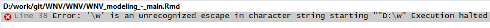\ 

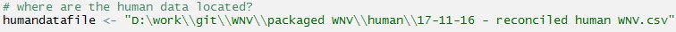\ 

## No estimates, blank maps

Unfortunately, if the Rmd file refuses to produce estimates (e.g. the red line is missing in the graphs or the maps are completely blank) then it's likely that a file is missing, is in an improper format, or there are extra files where they do not belong; e.g. only gridMet files should go in the gridMet data directory.

## Bad estimates

This is usually because of bad mosquito infection data. You will want to carefully check the mosquito infection data to ensure they are in the correct format. You will often be able to see this on the graph of the mosquito infection growth rate - a year in the past will dip down to very low levels of infection, but this does not seem historically accurate. Another problem can occur if you enter county names incorrectly. If the data tell the program that a case occurs in a county that does not exist, then this case will not be counted, and a county's risk will be artificially low. If this happens with enough counties (e.g. if every county is followed by a space in the data file) then a whole year's risk will be 0.

# Relevant scientific papers

* Davis, J. K., G. P. Vincent, M. B. Hildreth, L. Kightlinger, and M. C. Wimberly. 2018. Improving the prediction of arbovirus outbreaks: a comparison of climate-driven models for West Nile virus in an endemic region of the United States. Acta Tropica 185: 242-250.
* Davis J. K., Vincent G. P., Hildreth M. B., Kightlinger L., Carlson C., and M. C. Wimberly. 2017. Integrating Environmental Monitoring and Mosquito Surveillance to Predict Vector-borne Disease: Prospective Forecasts of a West Nile Virus Outbreak. PLoS Currents Outbreaks. 2017 May 23. Edition 1. doi: 10.1371/currents.outbreaks.90e80717c4e67e1a830f17feeaaf85de.
* Wimberly, M. C., A. Lamsal, P. Giacomo, and T. Chuang. 2014. Regional variation of climatic influences on West Nile virus outbreaks in the United States. American Journal of Tropical Medicine and Hygiene 91: 677-684. 
* Wimberly, M. C., P. Giacomo, L. Kightlinger, and M. B. Hildreth. 2013. Spatio-temporal epidemiology of human West Nile virus disease in South Dakota. International Journal of Environmental Research and Public Health 10: 5584-5602.
* Chuang, T., C. W. Hockett, L. Kightlinger, and M. C. Wimberly. 2012. Landscape-level spatial patterns of West Nile virus risk in the northern Great Plains. American Journal of Tropical Medicine and Hygiene 86: 724-731.
* Chuang, T., G. M Henebry, J. S. Kimball, D.L. VanRoekel-Patton, M. B. Hildreth, and M. C. Wimberly. 2012. Satellite microwave remote sensing for environment modeling of mosquito population dynamics. Remote Sensing of Environment 125: 147-156.
* Chuang T., and M. C. Wimberly. 2012. Remote Sensing of Climatic Anomalies and West Nile Virus 
* Chuang, T. M. B. Hildreth, M. B., D. L. VanRoekel, and M. C. Wimberly. 2011. Weather and land cover influences on mosquito populations in Sioux Falls, South Dakota. Journal of Medical Entomology 48: 669-679. 
* Wey, C. L., J. Griesse, L. Kightlinger, and M. C. Wimberly. 2009. Geographic variability in geocoding success for West Nile virus cases in South Dakota, USA. Health & Place 15: 1108-1114.
* Wimberly, M. C., M. B. Hildreth, S. P. Boyte, E. Lindquist, and L. Kightlinger. 2008. Ecological niche of the 2003 West Nile virus epidemic in the northern Great Plains of the United States. PLoS One 3: e3744.
